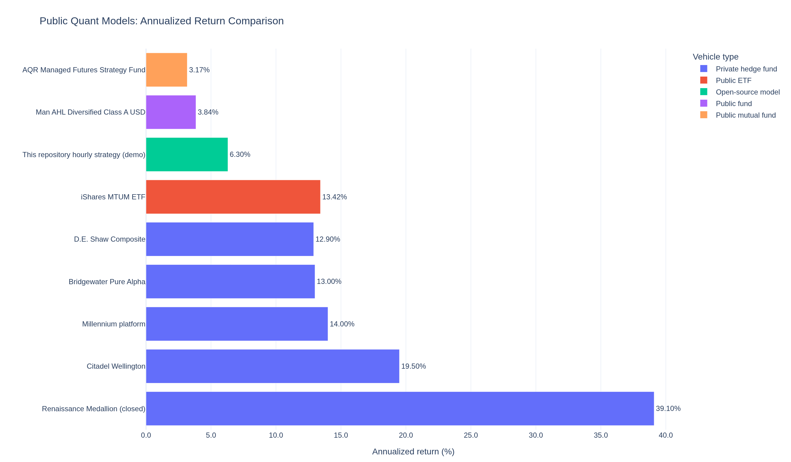
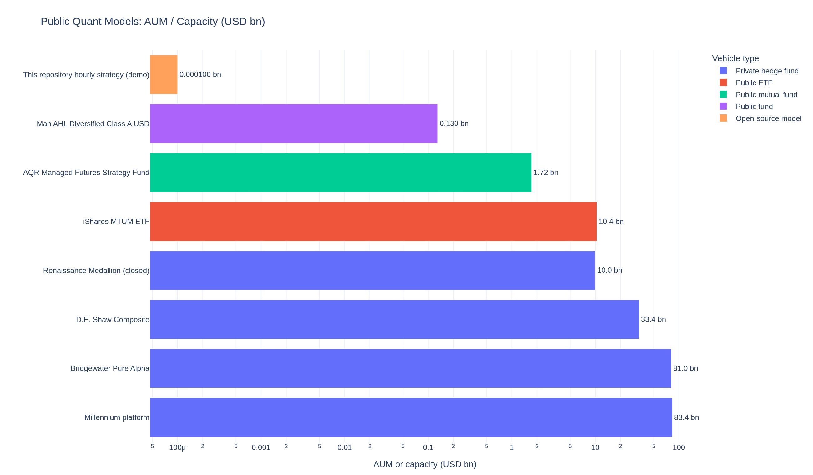
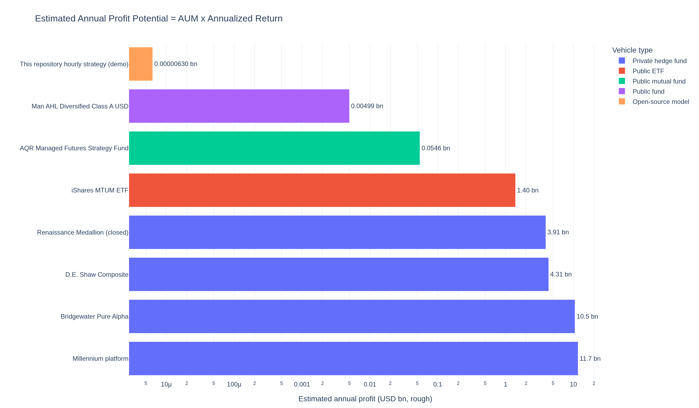
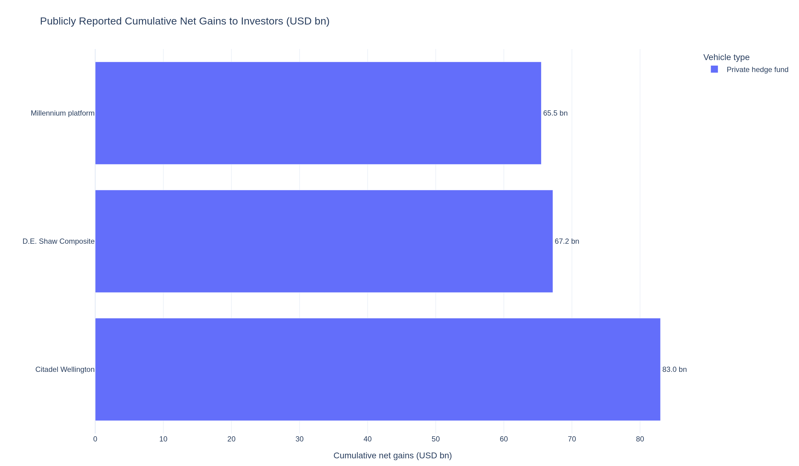
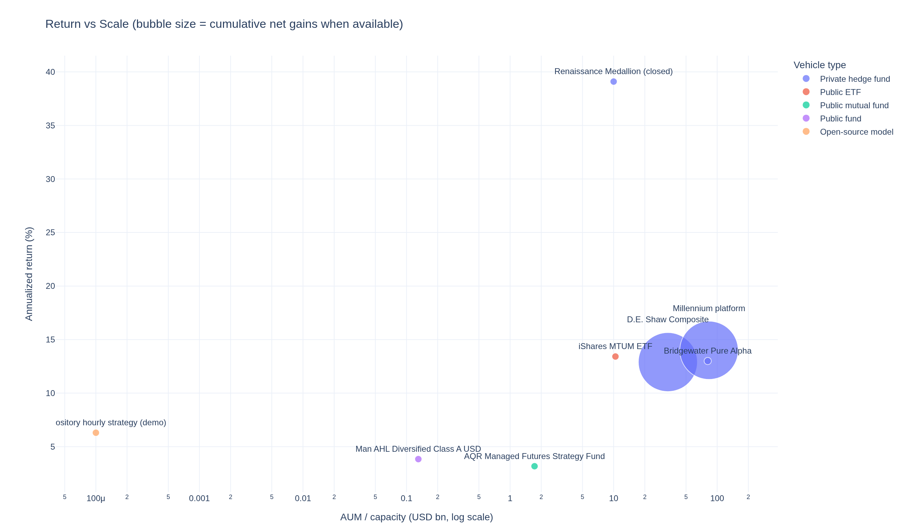

# Institutional Hourly Trading System (Production Blueprint)

This repository contains a production-grade blueprint implementation of an
**hourly long-only trading system** on **dynamic S&P 500 membership** with
strict anti-lookahead controls, cost-aware execution simulation, portfolio
optimization constraints, and analytics/dashboard outputs.

## What is included

- Point-in-time data contracts (`event_time`, `public_release_time`,
  `ingest_time`, `known_time`) and anti-lookahead enforcement.
- Feature engineering library (50+ features across price, volatility,
  cross-sectional, fundamentals, macro, sentiment, analyst, and freshness).
- Label engineering for:
  - 5-hour forward excess return vs SPY
  - downside event probability
- Dual model routes:
  - Route A: deep cross-sectional multitask model (Torch optional, deterministic fallback)
  - Route B: factor + LightGBM-style baseline (LightGBM optional, deterministic fallback)
- Long-only constrained portfolio construction:
  - max 10% per stock
  - liquidity filters
  - soft sector controls
  - target volatility band
  - turnover cap
- Event-driven hourly backtest engine:
  - signal at hour *t*
  - execution at hour *t+1 open*
  - slippage + spread + square-root impact
  - partial fill simulation
  - risk-state drawdown governance
- Metrics engine with required institutional KPIs.
- Dashboard blueprint payload builders and Streamlit starter script.
- Pytest test suite covering anti-lookahead, metrics, and end-to-end flow.
- Live production integration layer:
  - OMS/EMS adapter interfaces (paper + HTTP broker gateway)
  - signed REST adapter template (HMAC), retry policy, and idempotency keys
  - multi-broker OMS templates (Alpaca/Binance spot/IBKR gateway)
  - WebSocket callback template for order status streams
  - heartbeat + sequence checkpoint/resume for WS streams
  - gap recovery callback with REST replay template
  - exactly-once dedup storage (SQLite WAL, optional Redis)
  - real-time queue abstraction (in-memory + file-backed)
  - alert router (console/file/webhook)
  - model registry with approval workflow
  - champion/canary deployment, promotion, and rollback governance
  - fill reconciliation and broker-vs-expected break detection
  - live TCA attribution (shortfall/fees/total cost bps) from order-to-fill linkage
  - kill-switch / circuit-breaker / limit protection guard rails
  - file-backed control plane for manual kill-switch and approval-based unlock
  - RBAC policy for kill-switch / unlock approval / finalize actions

## Directory layout

```text
src/hourly_trading_system/
  data/           # PIT contracts, adapters, and store logic
  features/       # feature library
  labels/         # label engineering
  models/         # Route A + Route B models
  portfolio/      # allocation and constraints
  execution/      # transaction cost + fills
  risk/           # drawdown and risk regime controls
  backtest/       # event-driven simulation engine
  analytics/      # performance metrics
  dashboard/      # panel blueprint
  governance/     # model approval, canary, rollback controls
  live/           # queue, alerting, live contracts
  orchestration/  # research/paper/live pipeline wrapper
scripts/
  run_demo_backtest.py
  run_dashboard.py
  run_live_cycle_demo.py
  run_live_monitor.py
  run_broker_ws_listener_template.py
  run_live_from_config_template.py
  run_live_hourly_loop.py
  generate_model_result_dashboard.py
  generate_public_quant_comparison_charts.py
  run_production_preflight.py
  run_preflight.sh
deploy/
  kubernetes/     # CronJob + monitor deployment templates
  airflow/        # DAG template
  systemd/        # service/timer templates
docs/
  public_quant_model_comparison.csv
  PUBLIC_QUANT_COMPARISON_SOURCES.md
  assets/         # README comparison figures
  bootstrap_cloud_env.sh
tests/
```

## Quickstart

### 1) Install

```bash
pip install -e ".[dev]"
```

Optional extras:

```bash
pip install -e ".[dashboard,live,ml]"
```

Cloud default environment command:

```bash
python3 -m pip install -e ".[dev,dashboard,live]"
```

### 2) Run end-to-end demo

```bash
python scripts/run_demo_backtest.py
```

This generates output files under `outputs/`:

- `equity_curve.csv`
- `fills.csv`
- `weights.csv`
- `risk_history.csv`
- `monthly_returns.csv`

### 3) Run tests

```bash
pytest
```

### 4) Dashboard (optional)

```bash
streamlit run scripts/run_dashboard.py
```

### 5) Live cycle demo (registry + canary + OMS routing)

```bash
python3 scripts/run_live_cycle_demo.py
```

### 6) Real-time live monitor (queue stream, not offline CSV)

```bash
streamlit run scripts/run_live_monitor.py
```
Default queue path is `outputs/live_queue`.
The monitor includes health score, queue depths, TCA summary, and a rollback control panel.
It also includes control-plane actions:
- Force Kill-Switch
- Request Unlock
- Approve Unlock
- Finalize Unlock (requires approvals)

### Broker WebSocket listener template

```bash
python3 scripts/run_broker_ws_listener_template.py
```
Required environment variables:
- `BROKER_WS_URL`
- `BROKER_API_KEY`
- `BROKER_API_SECRET`
Optional:
- `BROKER_API_PASSPHRASE`
- `LIVE_QUEUE_PATH`
- `BROKER_WS_SEQUENCE_FIELD` (default: `sequence`)
- `BROKER_WS_SEQUENCE_STATE_PATH` (default: `outputs/ws_sequence.state`)
- `BROKER_KIND` (e.g. `binance_spot`)
- `BINANCE_REST_URL` and `BROKER_REPLAY_SYMBOL` for official replay mode
- `LIVE_DEDUP_BACKEND` (`sqlite` or `redis`)
- `LIVE_DEDUP_SQLITE_PATH` (default: `outputs/live_events.db`)
- `LIVE_DEDUP_REDIS_URL` (if using redis backend)

### Build live runner from config template

```bash
python3 scripts/run_live_from_config_template.py
```

### Scheduled hourly live loop

Single cycle:

```bash
python3 scripts/run_live_hourly_loop.py --mode synthetic --once
```

Bounded loop (for staging):

```bash
python3 scripts/run_live_hourly_loop.py --mode synthetic --max-cycles 3
```

### Deployment templates

See:

```text
deploy/README.md
```

### One-click production preflight

```bash
bash scripts/run_preflight.sh
```
This runs:
- config + environment preflight (`scripts/run_production_preflight.py`)
- smoke tests for control plane and live execution extensions.

### Generate result dashboard artifact (HTML + summary JSON)

```bash
python3 scripts/generate_model_result_dashboard.py
```
Outputs:
- `outputs/model_result_dashboard.html`
- `outputs/model_result_summary.json`
- optionally `outputs/equity_drawdown.png` (if image backend is available)

### Latest test-set performance snapshot

Test request window: `2026-01-01` to `2026-02-26`  
Computed on hourly equity series generated by the current demo pipeline.

| Metric | Value |
|---|---:|
| Period start | `2025-12-31 20:00:00+00:00` |
| Period end | `2026-02-25 20:00:00+00:00` |
| Total return | `1.0534%` |
| CAGR | `6.2988%` |
| Annualized volatility | `4.0350%` |
| Sharpe | `1.5341` |
| Sortino | `2.4397` |
| Calmar | `4.6222` |
| Max drawdown | `1.3627%` |
| Turnover | `0.0793` |
| Exposure | `25.0382%` |

Conclusion (for this test run): **successful** under the stated risk constraints  
(positive return, Sharpe > 1, max drawdown far below 20% guardrail).

> Note: this snapshot is from the repository demo/backtest flow and should be
> treated as a reproducible research baseline. For production sign-off, rerun
> with institution-approved market/fundamental/sentiment feeds and full broker
> connectivity.

## Public quant model comparison (公开案例：量化模型能做到多少钱)

This section adds **publicly reported** quant-fund benchmarks for scale context.

- Raw comparison data: `docs/public_quant_model_comparison.csv`
- Source mapping and caveats: `docs/PUBLIC_QUANT_COMPARISON_SOURCES.md`
- Regenerate charts:

```bash
python3 scripts/generate_public_quant_comparison_charts.py
```

### Visual comparison (more intuitive)

**1) Annualized return (%)**



**2) AUM / strategy capacity (USD bn, log scale)**



**3) Rough annual dollar profit potential = AUM x annualized return**



**4) Publicly reported cumulative net gains to investors (USD bn)**



**5) Return vs scale scatter (bubble = cumulative gains if available)**



### Quick numeric comparison (rough, educational)

| Model / strategy | Annualized return | AUM / capacity | Rough annual scale PnL (AUM x return) | Public cumulative net gains |
|---|---:|---:|---:|---:|
| Renaissance Medallion (closed) | 39.1% | 10.0 bn | 3.91 bn/yr | n/a |
| Citadel Wellington | 19.5% | n/a | n/a | 83.0 bn |
| D.E. Shaw Composite | 12.9% | 33.4 bn | 4.31 bn/yr | 67.2 bn |
| Millennium platform | 14.0% | 83.4 bn | 11.68 bn/yr | 65.5 bn |
| Bridgewater Pure Alpha | 13.0% | 81.0 bn | 10.53 bn/yr | n/a |
| iShares MTUM ETF | 13.42% | 10.41 bn | 1.40 bn/yr | n/a |
| AQR Managed Futures Strategy Fund | 3.17% | 1.722 bn | 0.055 bn/yr | n/a |
| Man AHL Diversified Class A USD | 3.84% | 0.130 bn | 0.005 bn/yr | n/a |
| **This repository hourly strategy (demo)** | **6.30%** | **0.0001 bn** | **0.000006 bn/yr (~$6.3k/yr)** | n/a |

### Interpretation for this repository

- Your current model has positive risk-adjusted results in the test window.
- The biggest gap versus top institutions is **not only model alpha**, but also
  **deployable capital scale + execution infrastructure + strategy capacity**.
- If your target is "make more money", the roadmap is usually:
  1. improve robustness across regimes,
  2. raise capital/capacity safely,
  3. keep drawdown and slippage stable while scaling.

> Important comparability caveat:
> these figures mix private hedge funds, public ETFs/mutual funds, and one
> open-source demo strategy; time windows, fees, lockups, leverage, and
> investability are different. Treat this as **context benchmarking**, not an
> apples-to-apples ranking or investment advice.

### 7) Cloud environment bootstrap script

```bash
bash scripts/bootstrap_cloud_env.sh
```
This script:
- ensures `PATH` includes `$HOME/.local/bin` (pytest discoverable),
- installs editable package with dev deps,
- validates Python/pip/pytest availability.

For cloud startup automation, see:

```text
cloud/startup.sh
```

## Production assumptions and controls

- Long-only, no leverage, cash allowed.
- Position cap: 10% per stock.
- Signal at `t`, execute at `t+1 open`.
- Cost model:
  - slippage: 1.0 bps
  - half-spread: 0.5 bps
  - impact: `eta * sqrt(participation)`
- Dynamic universe handled through point-in-time membership table.
- Hard drawdown governance via risk state transitions:
  - normal → conservative → risk_off.
- Live order safety includes:
  - max orders per cycle
  - max notional per order/cycle
  - rejection-streak circuit breaker
  - intraday loss kill-switch
  - protective limit-price conversion for market orders

## Important note

This codebase is a production **blueprint + executable framework**.
For live deployment, plug in institution-approved data vendors,
OMS/EMS integration, compliance controls, and hardened infrastructure
(secrets management, authZ, full observability, and disaster recovery).
